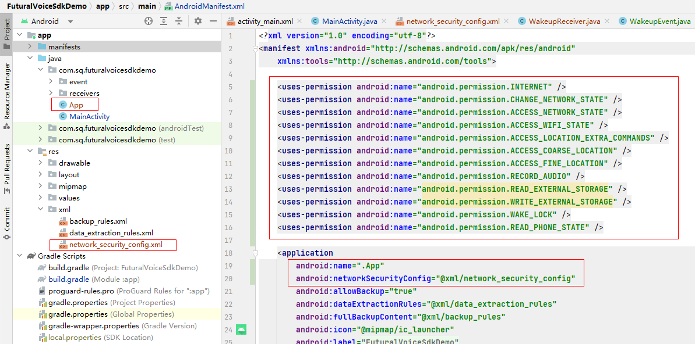

<a href="./readme.md">English</a> <a href="./readme_zh_cn.md">中文</a>

### SDK usage instructions
1. Import aar files and dependent projects
    
2. Add application permissions, App subcategories, and network configurations
    
---
### API usage instructions
After the robot is started successfully, it means that the robot is in the ready state.
1. Wake-up notification -- Say "Xiaoqing, Xiaoqing" to the microphone on the robot, and the system will send out the following broadcast. The app can just listen to this broadcast. When the broadcast is received, the angle information of the microphone can be obtained
```
     <receiver
         android:name=".receivers.WakeupReceiver"
         android:exported="true">
         <intent-filter>
             <action android:name="com.jack.wakeup" />
         </intent-filter>
     </receiver>
```
2. Monitor voice input -- call the following code and set the callback function. The text information will be obtained in the callback function.
```
     XunFeiIATMgr.getInstance().init(getApplicationContext());
     XunFeiIATMgr.getInstance().setIatCallback(this);
```
3. Obtain semantics - call the following code to obtain semantics, and the semantic information will be obtained in the callback function
```
     AIUIMgr.getInstance().init(getApplicationContext());
     AIUIMgr.getInstance().setNlpResultCallBack(this);
```
4. TTS use -- call the following code to initialize TTS, and then you can use it
```
    TTSManager.getInstance().init(getApplicationContext(), TTSManager.TTS_TYPE_XUNFEI, "");
```

For details, please refer to the source code