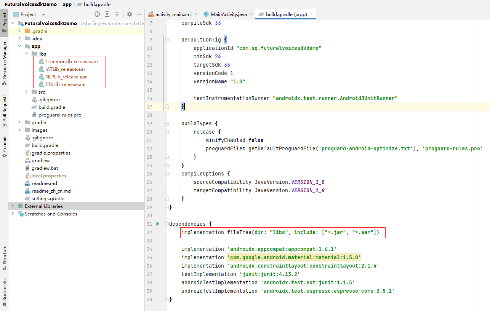
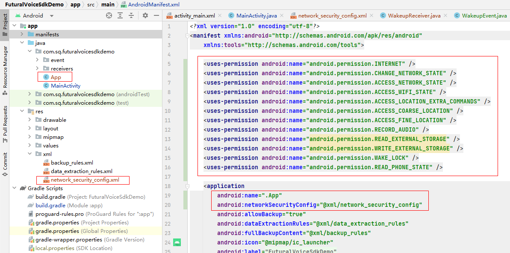

<a href="./readme.md">English</a>  <a href="./readme_zh_cn.md">中文</a>

### SDK使用说明
1. 导入aar文件及依赖的项目
   
2. 添加应用权限、App子类、网络配置
   
---
### API使用说明
机器人整机启动成功后，表示机器人整机处于ready状态
1. 唤醒通知 -- 对着机器人上的麦克风说“小晴，小晴”，系统会发出如下广播，app监听此广播即可，收到广播时，可以获得麦克风的角度信息
```
    <receiver
        android:name=".receivers.WakeupReceiver"
        android:exported="true">
        <intent-filter>
            <action android:name="com.jack.wakeup" />
        </intent-filter>
    </receiver>
```
2. 监听语音输入 -- 调用如下代码，并设置回调函数，在回调函数中会得到文本信息
```
    XunFeiIATMgr.getInstance().init(getApplicationContext());
    XunFeiIATMgr.getInstance().setIatCallback(this);
```
3. 获得语义 -- 调用如下代码来获得语义，在回调函数中会得到语义信息
```
    AIUIMgr.getInstance().init(getApplicationContext());
    AIUIMgr.getInstance().setNlpResultCallBack(this);
```
4. TTS使用 -- 调用如下代码来初始化TTS，之后就可以使用了
```
   TTSManager.getInstance().init(getApplicationContext(), TTSManager.TTS_TYPE_XUNFEI, "");
```

详细信息，请参考源码